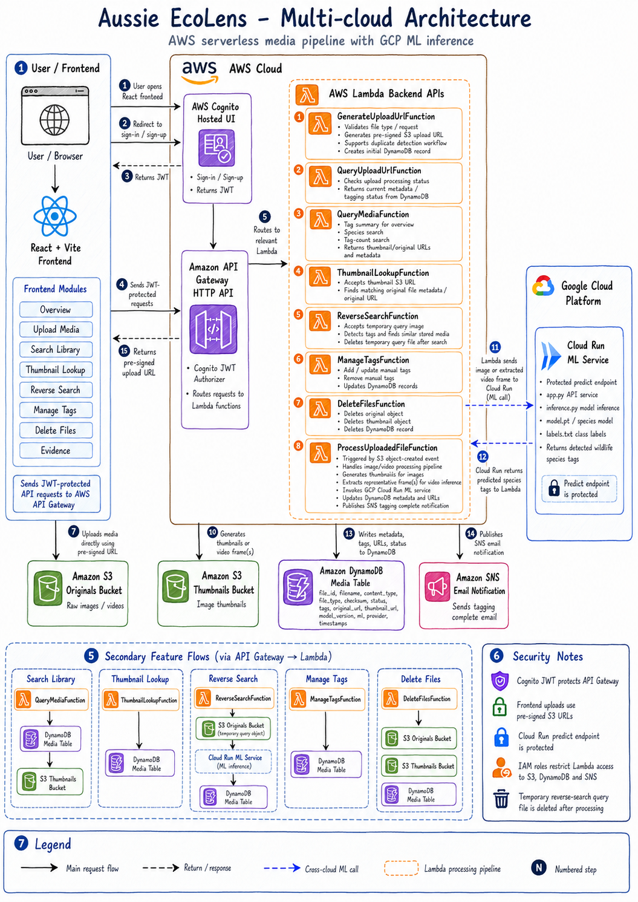
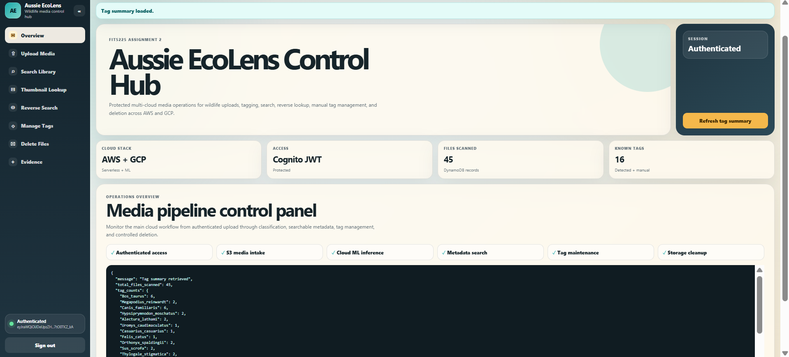
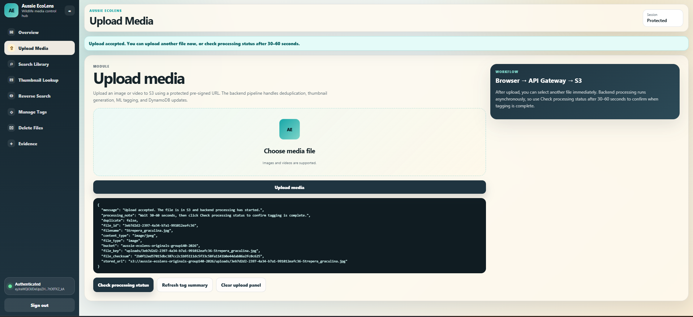
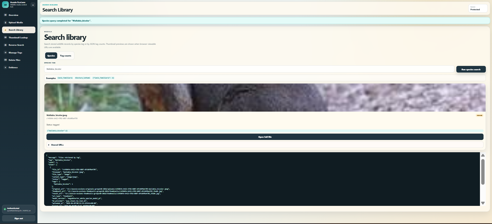
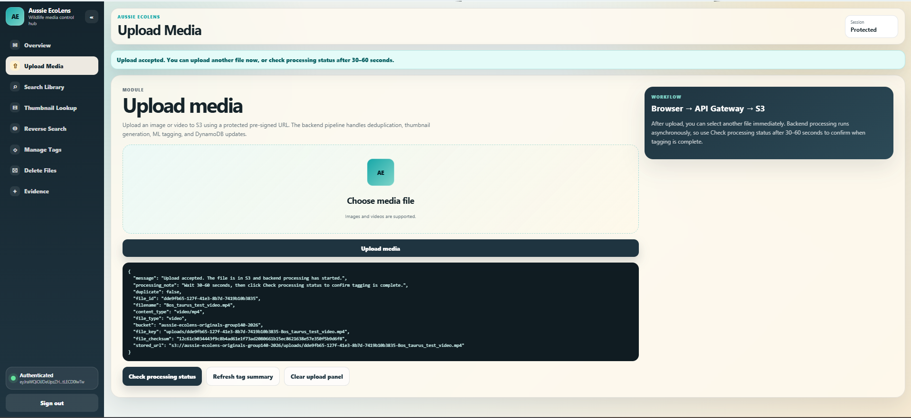

# Aussie EcoLens Serverless Media Platform

Aussie EcoLens is a serverless media-processing platform for uploading wildlife images and videos, extracting machine-learning tags, storing searchable metadata, and exploring results through a React dashboard.

The project combines an AWS serverless backend, a React/Vite frontend, and a local/GCP-compatible machine-learning service built around MegaDetector-style object detection workflows.

## Project Overview

Aussie EcoLens was designed for a wildlife image and video processing use case. Users authenticate through Cognito, upload media through pre-signed S3 URLs, and then query the processed media library by tags, species, counts, thumbnails, and reverse-search style inputs.

The backend uses Lambda functions to coordinate upload URL generation, duplicate detection, thumbnail creation, ML tagging, metadata storage, query APIs, and notification workflows. The frontend provides a dashboard for authenticated media management and search.

## Key Features

- Authenticated React dashboard for media upload and search workflows.
- Pre-signed S3 upload URL generation for images and videos.
- AWS Lambda backend functions for media processing and metadata operations.
- DynamoDB-backed media metadata and tag storage.
- Duplicate media detection using file checksums.
- Thumbnail generation for uploaded images.
- ML tagging pipeline for wildlife/object detection.
- Bulk tag add/remove workflows.
- Search by species, tag count, thumbnail URL, and original media URL.
- SNS-style notification workflow for processed media events.
- Local ML service and GCP Cloud Run-compatible ML service implementation.

## Tech Stack

- React
- Vite
- JavaScript
- AWS Lambda
- Amazon S3
- Amazon DynamoDB
- Amazon Cognito
- Amazon SNS
- API Gateway
- Python
- Boto3
- Pillow
- MegaDetector / YOLO-style model inference
- Docker
- Google Cloud Run-compatible ML service

## Repository Structure

```text
aussie-ecolens-serverless-media-platform/
├── README.md
├── backend/
│   └── lambdas/
│       ├── generate_upload_url/
│       ├── process_uploaded_file/
│       ├── query_media/
│       ├── query_upload_url/
│       └── tag_uploaded_file/
├── frontend/
│   ├── src/
│   ├── public/
│   ├── package.json
│   └── .env.example
├── ml-service/
│   ├── batch.py
│   ├── detector.py
│   ├── inference.py
│   ├── pipeline.py
│   ├── local_db.py
│   └── requirements.txt
├── ml-service-gcp/
│   ├── app.py
│   ├── Dockerfile
│   ├── inference.py
│   └── requirements.txt
├── sample-data/
├── screenshots/
└── docs/
```

## Architecture



## Frontend

The frontend is a Vite React app.

```bash
cd frontend
npm install
npm run dev
```

Create `frontend/.env` from `frontend/.env.example` and add your deployed API Gateway and Cognito values.

```text
VITE_API_BASE_URL=https://your-api-gateway-url
VITE_COGNITO_DOMAIN=https://your-cognito-domain
VITE_COGNITO_CLIENT_ID=your-cognito-client-id
VITE_COGNITO_REDIRECT_URI=http://localhost:3000
```

## Backend Lambdas

The backend Lambda functions are stored under `backend/lambdas/`.

| Function | Purpose |
|---|---|
| `generate_upload_url` | Creates pre-signed S3 upload URLs and initial metadata records |
| `process_uploaded_file` | Processes S3 upload events, checks duplicates, and creates thumbnails |
| `tag_uploaded_file` | Calls the ML service, stores generated tags, and sends notifications |
| `query_media` | Provides search/query APIs over stored media metadata |
| `query_upload_url` | Creates pre-signed URLs for reverse-search style upload inputs |

The GitHub version uses environment-variable placeholders for cloud resource names. Configure these in Lambda settings or infrastructure code:

```text
ORIGINALS_BUCKET
your-originals-bucket
THUMBNAILS_BUCKET
your-thumbnails-bucket
MEDIA_TABLE_NAME
AussieEcoLensMedia
QUERY_BUCKET
your-originals-bucket
SNS_TOPIC_ARN
arn:aws:sns:region:account-id:topic-name
INTERNAL_API_KEY
replace-me
GCP_PREDICT_URL
https://your-cloud-run-service/predict
```

## ML Service

The `ml-service/` folder contains the local batch and pipeline logic for running object detection across sample images.

```bash
cd ml-service
python -m pip install -r requirements.txt
python batch.py
```

Large model files are intentionally not committed. To run the full pipeline locally, place the required model artifacts in `ml-service/`:

```text
ml-service/mdv5a.pt
ml-service/model.pt
```

## GCP-Compatible ML Service

The `ml-service-gcp/` folder contains a containerised prediction service intended for deployment to Cloud Run or a similar container runtime.

```bash
cd ml-service-gcp
docker build -t aussie-ecolens-ml-service .
```

## Screenshots

### Authenticated Dashboard



### Upload Workflow



### Species Search



### Video Processing



## GitHub Notes

The repository intentionally excludes generated folders and private deployment files:

- `node_modules/`
- Python virtual environments
- real `.env` files
- AWS config notes
- assignment submission zips and AI declarations
- model weights such as `*.pt`
- generated crop/thumbnails/output JSON files

## Portfolio Summary

This project demonstrates practical full-stack cloud engineering across serverless APIs, authenticated frontend workflows, object storage, NoSQL metadata design, ML inference integration, media processing, and cloud deployment hygiene. It is especially useful as a portfolio project because it shows both application-level user workflows and backend cloud architecture.
